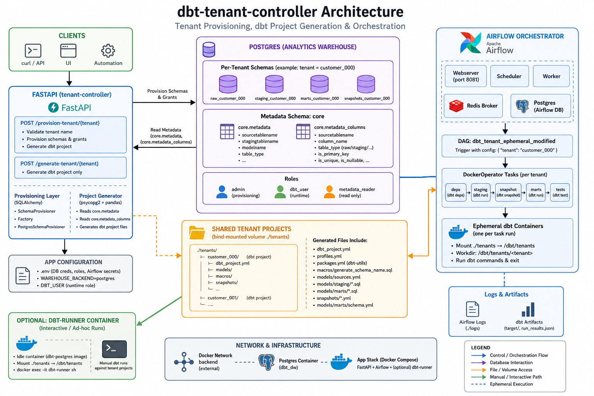

A multi-tenant data/analytics platform has the following challenges:

- every new tenant needs schemas (`raw_*`, `staging_*`, `marts_*`)
- correct permissions 
- dbt projects often start as copy/paste folders which can slowly differs over time

This repository is a small FastAPI service that turns onboarding workflow into a simple API call:

1. Provision per-tenant schemas inside Postgres.
2. Generate a per-tenant dbt project based on metadata stored in Postgres.
3. (Optionally) run dbt commands in a companion container.

---

## Important note: this is a PoC / reference implementation

This project demonstrates a useful pattern, but still far from a Prod implementation.

Treat it as a **reference guide** for the architecture and code organization rather than a production-ready service. The section **“Considerations for Production”** below outlines what you’d need to add or change to run this safely and reliably in a real environment.

---

## What the controller does

At a high level, the controller exposes two core capabilities:

### 1) Tenant-aware schema provisioning

For a tenant name `acme`, it creates schemas:

- `raw_acme`
- `staging_acme`
- `marts_acme`
- `snapshots_acme`

and applies grants so a dbt runtime role (defaults to `dbt_user`) can create tables/views and query objects.

### 2) Metadata-driven dbt project generation

It generates an entire dbt project directory per tenant, including:

- `dbt_project.yml`
- `profiles.yml`
- `packages.yml` (dbt-utils)
- `macros/generate_schema_name.sql` (to control schema naming)
- `models/sources.yml`
- staging and mart models (`models/staging/*.sql`, `models/marts/*.sql`)
- snapshots (`snapshots/snapshot_<model>.yml`)
- marts docs + tests (`models/marts/schema.yml`)

The project is generated from a Postgres table:

```sql
SELECT * FROM core.metadata
```

Expected columns include (see `init_core_metadata.sql` for the exact contract used by this repo):

- `sourcetablename`
- `stagingtablename`
- `modelname`
- `table_type` (e.g. `dimensions` / `fact`)

The generator also reads column-level metadata from:

```sql
SELECT * FROM core.metadata_columns
```

At minimum it expects:

- `sourcetablename`
- `column_name`

Optional columns like `table_type`, `is_primary_key`, `is_unique`, `is_nullable` are used to derive dbt tests.

---

## Architecture overview

The deployment model is intentionally simple, but now includes an **Airflow orchestrator** alongside the control plane.

In the current codebase:

- **FastAPI** does tenant provisioning + dbt project generation.
- **Airflow** orchestrates dbt execution (via ephemeral dbt containers).

```text
Client (curl / UI / automation)
   |
   v
FastAPI (tenant-controller)
   |  (SQLAlchemy) provisions schemas + grants
   |  (psycopg2/pandas) reads core.metadata + core.metadata_columns
   v
Postgres (warehouse)

FastAPI writes tenant dbt project into ./tenants/<tenant> (bind-mounted into containers)
   |
   +--> (optional) dbt-runner container (for interactive `docker exec` runs)
   |
   +--> Airflow (webserver/scheduler/worker + Redis + Airflow DB)
          |
          v
       DockerOperator launches ephemeral dbt containers per task
       - mounts ./tenants into the dbt container at /dbt/tenants
       - runs: deps -> run staging -> snapshot -> run marts -> test
```




The API generates dbt projects into a shared folder (`./tenants`). Both the optional `dbt-runner` container and Airflow-triggered ephemeral dbt containers can run dbt against those generated projects.


**Postgres as an assumed dependency**

>This PoC assumes an existing Postgres instance acting as the analytics warehouse. Postgres may be run locally (Docker), in Kubernetes, or as a managed service (RDS / Cloud SQL / Azure Flexible Server).


## Local setup 

This section is an end-to-end local setup for:

- a Postgres DW container
- the metadata contract tables and sample seed metadata
- a sample raw schema and raw CSV load
- the tenant-controller and Airflow containers (and an optional dbt-runner)

> Notes
>
> - Commands below assume **Windows** paths + `cmd.exe` escaping (using `^`).
> - Passwords shown here are for local demo convenience.

### 0) Postgres setup (Docker)

Create a local Postgres container:

```bat
docker run -d ^
  --name dbt_dw ^
  -e "POSTGRES_USER=admin" ^
  -e "POSTGRES_PASSWORD=<password>" ^
  -e "POSTGRES_DB=analytics" ^
  -p 5433:5432 ^
  -v pgdata2:/var/lib/postgresql/data ^
  -v C:/projects/data/postgres:/data ^
  --restart unless-stopped ^
  postgres:17
```

Key mounts:

- `-v pgdata2:/var/lib/postgresql/data` — named volume for **Postgres data files** (keeps the database across restarts)
- `-v C:/projects/data/postgres:/data` — host folder mounted into the container
  - we’ll copy SQL and CSV seed files here so they’re accessible inside the container

### 1) Create a Docker network for the app stack (required)

`docker-compose.yml` expects an **external** network named `backend`.

```bash
docker network create backend
docker network connect backend dbt_dw
```

### 2) Create the metadata schema + seed sample metadata

Run these scripts (in order):

- `init_core_metadata.sql`
- `generate_metadata.sql`

Option A: run in pgAdmin (query tool) by pasting the file contents.

Option B: run via `psql` inside the container (recommended):

1) Copy the SQL files into the mounted host folder:

```bat
copy init_core_metadata.sql C:\projects\data\postgres\init_core_metadata.sql
copy generate_metadata.sql C:\projects\data\postgres\generate_metadata.sql
```

2) Execute them inside Postgres:

```bat
docker exec -i dbt_dw psql -U admin -d analytics -f /data/init_core_metadata.sql
docker exec -i dbt_dw psql -U admin -d analytics -f /data/generate_metadata.sql
```

### 3) Create the sample raw schema

This creates the raw tables under a schema you choose (example: `raw_customer_000`).

1) Copy the schema seed SQL into the mounted folder:

```bat
copy seed_raw_schema.sql C:\projects\data\postgres\seed_raw_schema.sql
```

2) Run it with `raw_schema=raw_customer_000`:

```bat
docker exec -i dbt_dw psql -U admin -d analytics -v raw_schema=raw_customer_000 -f /data/seed_raw_schema.sql
```

> If you prefer an interactive `psql` session:
>
> ```sql
> \set raw_schema raw_customer_000
> \i /data/seed_raw_schema.sql
> ```

### 4) Create and load the raw CSV files

1) Generate seed CSVs (from the repo root):

```bat
python seed_raw_data.py
```

This writes CSVs to `./raw_data/`.

2) Copy the generated CSVs and `reload_and_validate_raw.sql` to the mounted host folder so Postgres can read them:

```bat
mkdir C:\projects\data\postgres\raw_data
xcopy /E /I /Y raw_data C:\projects\data\postgres\raw_data
copy reload_and_validate_raw.sql C:\projects\data\postgres\raw_data\reload_and_validate_raw.sql
```


3) Connect to Postgres in the container:

```bat
docker exec -it dbt_dw psql -U admin -d analytics
```

4) Run the reload script (loads CSVs into `raw_customer_000.*` tables):

```sql
\i /data/raw_data/reload_and_validate_raw.sql
```

> `reload_and_validate_raw.sql` is currently hard-coded to `raw_customer_000`. If you used a different raw schema name, edit that file accordingly.

---

## Tenant Controller setup

### 1) Clone the repo and install Python requirements (for local scripts/dev)

```bat
git clone https://github.com/fr4nc1sj0hn/dbt-tenant-controller.git
cd dbt-tenant-controller

python -m venv .venv
.venv\Scripts\activate
pip install -r requirements.txt
```

> You’ll still run the app via Docker Compose below, but having deps installed locally is helpful for running seed scripts like `seed_raw_data.py`.

### 2) Create a `.env` file

Copy the sample:

```bat
copy .env.sample .env
```

Then update the values to match your Postgres container. For the Postgres container above, a typical local config is:

```env
POSTGRES_HOST=dbt_dw
POSTGRES_PORT=5432
POSTGRES_DB=analytics

ADMIN_USER=admin
ADMIN_PASSWORD=<password>

DBT_USER=dbt_user
DBT_USER_PASSWORD=<password>

# Airflow secrets (required by docker-compose.yml)
AIRFLOW_CORE_FERNET_KEY=<set-me>
AIRFLOW_WEBSERVER_SECRET_KEY=<set-me>
```

Generate values quickly:

```bash
python -c "import base64,secrets; print(base64.urlsafe_b64encode(secrets.token_bytes(32)).decode())"
python -c "import secrets; print(secrets.token_hex(32))"
```

### 3) Run the app via Docker Compose

This repo’s `docker-compose.yml` now starts:

- FastAPI (`tenant-controller`)
- Airflow (webserver/scheduler/worker) + Redis + Airflow metadata DB
- (optional) `dbt-runner` (idle container for manual dbt)

First-time only: initialize Airflow:

```bash
docker compose up airflow-init
```

```bash
docker compose up -d --build
```

FastAPI:

- http://localhost:8000
- http://localhost:8000/docs

Airflow UI:

- http://localhost:8081
- login: `airflow` / `airflow`

### 4) Provision a tenant

```bash
curl -X POST http://localhost:8000/provision-tenant/customer_000
```

### 5) Connect to the dbt-runner container

(Optional) If you want to run dbt manually:

```bash
docker exec -it dbt-runner sh
```

### 6) Run the dbt project

```bash
cd /dbt/tenants/customer_000
dbt deps
dbt run --select staging
dbt snapshot
dbt run --select marts
dbt test
```

### 7) View the dbt documentation (optional)

Run this **inside** the `dbt-runner` container (after `cd /dbt/tenants/<tenant>`):

```bash
dbt docs generate
dbt docs serve --host 0.0.0.0 --port 8080
```

Then open http://localhost:8090.

This works because `docker-compose.yml` publishes the port:

```yaml
ports:
  - "8090:8080"
```

### 8) Orchestrate dbt with Airflow (recommended path)

1) Open Airflow UI: http://localhost:8081
2) Find the DAG: **`dbt_tenant_ephemeral_modified`**
3) Trigger it with a tenant (optional; default is `customer_000`). Example config:

```json
{ "tenant": "customer_000" }
```

This DAG uses **DockerOperator** to run dbt in short-lived containers against `./tenants/<tenant>`.


---
## Repo layout

```text
.
├─ app/
│  ├─ main.py                     # FastAPI entrypoint + endpoints
│  ├─ provisioning/
│  │  ├─ base.py                   # Provisioner interface (SchemaProvisioner)
│  │  ├─ factory.py                # Chooses backend provisioner via env var
│  │  └─ postgres.py               # Postgres schema provisioning implementation
│  ├─ project_generator.py         # Per-tenant dbt project generator (recommended)
├─ dags/                           # Airflow DAGs (DockerOperator-based dbt orchestration)
├─ airflow.md                      # Airflow wiring + concepts for this repo
├─ tenants/                        # Generated per-tenant dbt projects (bind-mounted)
├─ logs/                           # Airflow logs (bind-mounted)
├─ Dockerfile
├─ docker-compose.yml              # FastAPI + Airflow (+ optional dbt-runner)
└─ requirements.txt
```

---

## API endpoints

The FastAPI entrypoint is `app/main.py`. It wires up:

- a SQLAlchemy engine/session (for provisioning)
- a `DBTProjectGenerator` (for project generation)

### Provision and generate

```bash
curl -X POST http://localhost:8000/provision-tenant/customer_000
```

What happens:

1. Validates the tenant name (`tenant_name.isidentifier()`)
2. Provisions schemas and grants via the selected provisioner
3. Generates a dbt project folder under `/app/tenants/customer_000`

Note:

- Provisioning creates `raw_*`, `staging_*`, `marts_*`, and `snapshots_*` schemas.
- The current API response body lists `raw`, `staging`, and `marts` schemas (even though `snapshots_*` is also created).

### Generate only

```bash
curl -X POST http://localhost:8000/generate-tenant/customer_000
```

This skips provisioning and only generates dbt files.

---

## Schema provisioning details (Postgres)

Provisioning is implemented behind a small interface:

- `app/provisioning/base.py` -> `SchemaProvisioner`

and selected via a lightweight factory pattern:

- `app/provisioning/factory.py` reads `WAREHOUSE_BACKEND` (defaults to `postgres`)

The current implementation is:

- `app/provisioning/postgres.py` -> `PostgresSchemaProvisioner`

For each schema (`raw_<tenant>`, `staging_<tenant>`, `marts_<tenant>`, `snapshots_<tenant>`), it runs:

- `CREATE SCHEMA IF NOT EXISTS ...`
- `GRANT USAGE, CREATE ON SCHEMA ... TO dbt_user`
- `ALTER DEFAULT PRIVILEGES ...` to ensure future tables/sequences are accessible

Schema identifiers are safely quoted using `sqlalchemy.sql.quoted_name`.

---

## dbt project generation per tenant

The generator is `app/project_generator.py`. It creates a **separate dbt project folder per tenant** under a base path (in-container default: `/app/tenants`).

Generated tenant projects are persisted to the repo folder `./tenants/` via a bind mount:

- FastAPI: `./tenants` -> `/app/tenants`
- dbt-runner: `./tenants` -> `/dbt/tenants`
- Airflow containers also mount `./tenants` (so DAGs can orchestrate dbt runs against those projects)

### Generated Files

For each tenant it creates:

- standard dbt folders (`models/`, `macros/`, `tests/`, …)
- `dbt_project.yml` with schemas configured per layer:
  - staging models -> `staging_<tenant>`
  - marts models -> `marts_<tenant>`
- `profiles.yml` configured from connection params
- a macro (`generate_schema_name`) to control dbt’s schema selection
- `models/sources.yml` pointing at `raw_<tenant>` and the raw source tables
- staging models like `models/staging/<stagingtablename>.sql`
- mart models like `models/marts/<modelname>.sql`
- snapshots like `snapshots/snapshot_<modelname>.yml`
- a generated marts `schema.yml` with docs/tests: `models/marts/schema.yml`


### Metadata source

The generator uses a direct Postgres connection:

- `psycopg2` and `pandas.read_sql()`

to read:

```sql
SELECT * FROM core.metadata
```

Then it derives lists (lowercased) from the metadata columns:

- raw source tables: `sourcetablename`
- staging model names: `stagingtablename`
- mart model names: `modelname`


sample contents of `core.metadata` 

| modelname          | sourcetablename   | stagingtablename    | table_type   |
|-------------------|-------------------|---------------------|--------------|
| dim1              | raw_dim1          | stage_dim1          | dimensions   |
| fact_transactions | raw_transactions  | stage_transactions  | fact         |


### A note about the generated SQL

This PoC scaffolds models using the metadata tables as its contract.

- The list of raw source tables and staging/mart model names come from `core.metadata`.
- Column selection for staging models is derived from `core.metadata_columns` (filtered to `table_type='raw'`).
- `models/marts/schema.yml` tests are generated from `core.metadata_columns` flags like `is_primary_key`, `is_unique`, `is_nullable`.

In real implementations you’d typically:

- introspect actual columns from the warehouse (or store them in metadata)
- generate transformations that reflect tenant-specific semantics
- enforce tests (unique/not_null/accepted_values) from metadata

---

## Running it locally (Docker)

The recommended stack is in `docker-compose.yml`:

- `tenant-controller` (FastAPI)
- Airflow: `airflow-webserver`, `airflow-scheduler`, `airflow-worker`, plus `redis` and `airflow-db`
- (optional) `dbt-runner` (dbt-postgres image kept alive for `docker exec`)

It expects an **external Docker network** called `backend`:

```bash
docker network create backend
```

Connect the Postgres container to the same backend network (example container name: `dbt_dw`):

```bash
docker network connect backend dbt_dw
```

Then build and start:

```bash
docker compose up airflow-init
docker compose up -d --build
```


FastAPI:

- http://localhost:8000
- http://localhost:8000/docs

Airflow UI:

- http://localhost:8081

### Running dbt

The `dbt-runner` container is intentionally idle:

```bash
docker exec -it dbt-runner sh
cd /dbt/tenants/customer_000
dbt debug
dbt deps
dbt run --select staging
dbt snapshot
dbt run --select marts
dbt test
```

This is a POC that focuses on the different components to make it work. This avoids building a job system too early.

With Airflow added, you now have a lightweight job/orchestration layer. The working example DAG is:

- `dags/dbt_ephemeral_modified.py` (`dbt_tenant_ephemeral_modified`)

---

## Importance of this Pattern

- Onboarding a tenant becomes “insert metadata then call an API”
- dbt projects are generated consistently (no snowflake forks)
- schema naming and permissions become deterministic and repeatable

It also sets you up for extending the platform:

- add warehouses (Snowflake/BigQuery) by implementing a new `SchemaProvisioner`
- add more sophisticated generation (tests, snapshots, semantic models)
- integrate with CI/CD and a deployment pipeline

---

## Considerations for Production

This section is intentionally direct: **what’s missing** to make this production-ready.

### 1) Authentication, authorization, and tenant isolation

Right now, the API can create schemas and grants—this is a powerful operation.

For production you should add:

- **AuthN** (JWT/OIDC, API keys, mTLS, etc.)
- **AuthZ** rules (who is allowed to provision which tenants?)
- **Tenant name policy** (a strict allow-list or canonicalization strategy)
- **Audit logs** for provisioning actions (who/when/what)

### 2) Secrets management

The PoC reads credentials from environment variables.

Production should use a secret manager:

- Kubernetes Secrets (plus sealing/encryption)
- Docker Secrets
- Azure Key Vault / AWS Secrets Manager / GCP Secret Manager

Also consider splitting credentials:

- provisioning admin role (schema/grant privileges)
- metadata read role (read only `core.metadata`)
- dbt runtime role (least privilege for transformations)

### 3) Concurrency, locking, and atomic generation (to avoid corrupted tenant projects)

This PoC generates tenant projects by writing files into a shared folder (`./tenants`) that is bind-mounted into containers.

That works well for local demos, but in a multi-user / multi-replica environment you must assume **concurrent requests** and **retries**.

Key hazards:

- Two calls to `POST /generate-tenant/{tenant}` for the same tenant can interleave file writes and corrupt YAML/SQL.
- A regeneration can race with a `dbt run` reading/compiling the same project.

Recommended production mitigations:

- Treat **tenant** as the unit of concurrency.
- Add a **per-tenant lock** (Postgres advisory locks work well and require no extra infra).
- Make generation **atomic** (generate into a temp folder, then rename/move into place).
- Add **idempotency keys** for safe retries of provisioning/generation operations.

Design + code snippets (not implemented in this PoC): see [`concurrency_plan.md`](./concurrency_plan.md).

### 4) Robust dbt execution model (don’t rely on `docker exec`)

Keeping a container alive and executing dbt interactively is convenient, but production typically needs:

- a **job runner** (Celery/RQ/Arq) or a workflow engine (Airflow, Dagster, Prefect)
- **queued, idempotent tasks** with retries and backoff
- strong separation between API request/response and long-running dbt work
- concurrency controls (prevent two runs clobbering the same tenant project)

If you stay container-native, consider:

- Kubernetes Jobs per dbt invocation
- an internal build/execution service per tenant

### 5) Observability: logging, metrics, tracing

Add:

- structured logs (JSON)
- request IDs / correlation IDs
- Prometheus metrics (duration, error rates, dbt run outcomes)
- OpenTelemetry tracing across API -> DB -> job runner

### 6) Stronger input validation and safer SQL boundaries

The PoC checks `tenant_name.isidentifier()`, which is a good start.

Production should additionally:

- enforce a strict regex + max length
- decide on case normalization (lowercase recommended)
- explicitly reject reserved words and surprising Unicode identifiers
- enforce idempotency keys for repeated calls

### 7) Schema lifecycle management

Real systems need more than “create schema”:

- schema migrations/versioning
- rollback strategies
- tenant deprovisioning (and safe data retention policies)
- per-environment promotion flows (dev -> stage -> prod)

### 8) Metadata modeling and validation

The generator assumes `core.metadata` exists and contains expected columns.

Production improvements:

- define the metadata schema explicitly (DDL and migrations)
- validate metadata before generating projects
- version metadata changes (so generation is reproducible)
- consider tenant-scoped metadata (if tenants vary)

### 9) Template strategy and generated artifacts

Generated dbt projects are “source code”. In production you should decide:

- should the generated project be committed to Git?
- should generation be deterministic and reproducible?
- how do you handle updates to templates across many tenants?

Common approaches:

- generate into an artifact store and keep templates versioned
- generate on-demand per run rather than persisting per tenant

### 10) Container hardening and dependency pinning

For production:

- avoid floating tags like `latest` (pin dbt image versions)
- run containers as non-root where feasible
- add image scanning (Trivy/Grype)
- lock Python dependencies (hashes/constraints)

### 11) Testing strategy

Add automated coverage for:

- schema provisioning logic (unit and integration tests)
- dbt project generation (golden file tests)
- metadata parsing/validation
- API contracts (OpenAPI and contract tests)

### 12) Rate limiting and abuse protection

Because provisioning modifies DB permissions, you’ll likely want:

- rate limiting per caller
- protection against repeated/expensive operations
- backpressure when Postgres is under load

---


As a PoC, dbt-tenant-controller is a reference for treating tenant onboarding as an automated control plane.

If you’re building “platform dbt” in a multi-tenant setting, this repo can be a starting point to:

This repo can be a starting point to:
- formalize schema standards
- generate consistent dbt projects
- shift onboarding from manual steps to a workflow
